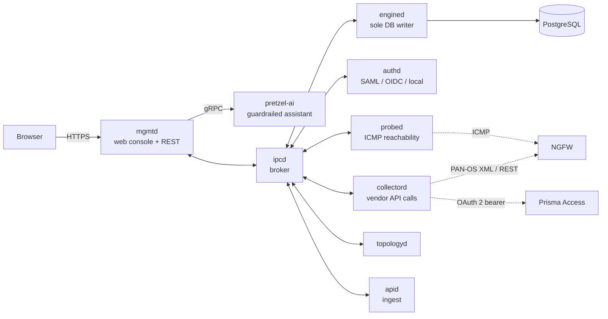

# pretzel

A management platform for a Palo Alto Networks estate — on-premises NGFW and Prisma Access tenants
under one inventory, driven over the vendors' own APIs.

Eight cooperating daemons in C++17 on Linux, a PostgreSQL-backed configuration store, and a TLS web
console.

---

## Why this exists

Every customer subscribes to a different mix of licences and asks a proof of concept to prove a
different thing. Standing that up by hand — a firewall here, a tenant there, keys minted and pasted,
"is it down or is my credential stale?" — is where the time goes, and none of it is the part that
demonstrates anything.

pretzel is the environment I build those demonstrations in: a single inventory that knows what a
device is, which credential opens it, which endpoints are worth polling, and whether it is actually
reachable. Its companion service, [pretzel-ai](https://github.com/starga-ze/Pretzel-AI), runs a live
RAG assistant behind a Prisma AIRS guardrail so a customer can watch an AI control act on a real
request rather than on a slide.

Building it also turned out to be the fastest way to learn the products properly. You cannot
integrate an API you only half understand.

---

## Architecture



Every daemon is an event loop. Work arrives as an **event**, a service decides what to do, and the
decision leaves as an **action** — nothing calls across a service boundary directly, so a request
that crosses three daemons is still three ordinary queue hops rather than a call stack nobody can
unwind.

`ipcd` brokers a length-prefixed frame protocol over unix sockets with a versioned wire contract and
addressed daemon ids. `engined` is the only process that writes to PostgreSQL; everything else asks
it to. That single rule is what keeps configuration convergence explainable.

---

## What it does

**Inventory.** NGFW devices and SASE tenants are separate tables with separate shapes, because they
are not the same object: a firewall is an address you connect to, a tenant is a scope you are
authorised for.

**Credential lifecycle.** Mints PAN-OS API keys from account credentials via `/api/?type=keygen` and
picks key delivery by call path — `key=` query parameter for the XML API, `X-PAN-KEY` header for
REST. For Prisma Access it takes a `scope=tsg_id:<TSG>` bearer from the OAuth 2.0
client-credentials grant. Expiry is tracked and re-issue is scheduled, so collection cannot fail
quietly behind a dead key.

**Health, in three layers.** Network reachability, credential validity and vendor-API availability
are reported as separate signals, so an outage is attributed before anyone opens a ticket. SASE has
nothing to ping — its health is a control-plane read.

**Collection.** A connector binds one inventory object to one credential and a list of endpoints
with per-endpoint poll intervals. Endpoints carry their own path and parameters, so any call can be
tested standalone before a connector exists. PAN-OS REST paths are version-scoped
(`/restapi/v10.2/…`) and a real estate runs several releases at once, so an upgrade publishes a
*second* endpoint rather than editing the first — and which devices still sit on the old path stays
answerable.

**Configuration.** A commit model in the shape operators already expect: an operator edits a
candidate, a commit mints a new version, and daemons converge onto it. Versions carry
`pending` → `active` → `superseded`, so a daemon that cold-restarts mid-reload loads the last known
good version and never the in-flight one.

**Console.** A TLS web UI over `mgmtd`: device status, settings and commit review, topology, API
collection, a system-log viewer that aggregates every daemon's log, and the assistant.

---

## Security design

The parts worth reading, if you are only going to read some of it:

- **Secrets at rest.** Account credentials — NGFW username/password, SASE client id/secret — are
  sealed with AES-256-GCM under a key file held by one service account. Plaintext custody lives in a
  single process; every other daemon handles sealed material only. A database copy taken without the
  key file is inert.

- **Two trust models, deliberately not unified.** A PAN-OS box presents a self-signed certificate,
  so the client pins an expected fingerprint behind a first-contact gate and refuses to send the
  request at all on a mismatch — credentials are never offered to an unverified peer. A Prisma
  Access call goes to a public CA endpoint where the chain and hostname are verified normally. One
  client trying to be both would be a switch statement wearing a class.

- **Single sign-on, implemented rather than imported.** A SAML 2.0 Service Provider doing XML-DSig
  verification against a pinned IdP certificate, assertion clock-skew windowing and IdP
  group-to-role mapping; plus Okta OIDC over the authorization-code flow with PKCE, `state`/`nonce`
  replay protection and RS256 ID-token verification.

- **Local accounts.** PBKDF2-SHA256 with per-user salt, and a forced change off the factory default
  on first login.

- **Bearer tokens are never configuration.** They are minted per call and held in memory; only the
  durable credential that mints them is persisted, and only sealed.

---

## Build and run

Requires Linux, CMake ≥ 3.16, a C++17 compiler, PostgreSQL and `libpq-dev`. Third-party
dependencies (Boost, OpenSSL, spdlog, nlohmann/json, gRPC, GoogleTest) are vendored into
`3rd_party/install` by the installer; `authd` additionally needs `xmlsec1-openssl` and `libxml2`.

```bash
./pretzel install     # fetch and build third-party deps, prepare /opt/pretzel
./pretzel build       # cmake + make
./pretzel start       # bring the daemons up under systemd
./pretzel stop
./pretzel test        # GoogleTest suite
```

`./pretzel front` redeploys only the console's static assets, and `./pretzel reset` clears state
back to a fresh install. Commands that touch `/opt/pretzel` re-exec themselves under `sudo`.

---

## Layout

```
pretzel              CLI dispatcher
script/              build / install / start / stop / reset / test
shared/              the common library: ipc, event, action, router, db, http, socket, config, util
ipcd/                IPC broker
engined/             sole DB writer: commit, credentials, probe results, log tailing
authd/               local accounts, SAML 2.0 SP, Okta OIDC
probed/              ICMP reachability
collectord/          vendor API calls: PAN-OS keygen and REST/XML, Prisma Access OAuth, collection
topologyd/           topology derivation
mgmtd/               TLS web console, REST API, gRPC client to pretzel-ai
apid/                ingest
```

---

## Status

Working end to end and used as a lab and demonstration environment. Active work is on the
configuration-version convergence path and on moving the assistant's transport fully to gRPC. This
is a personal project, not a product, and it is not affiliated with or endorsed by Palo Alto
Networks; product names are used only to describe what it integrates with.
